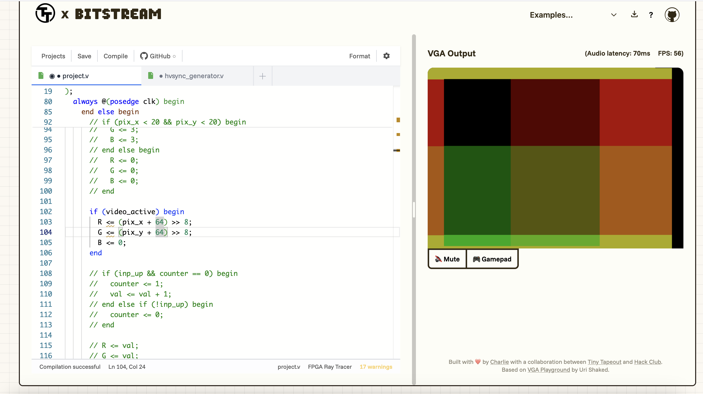
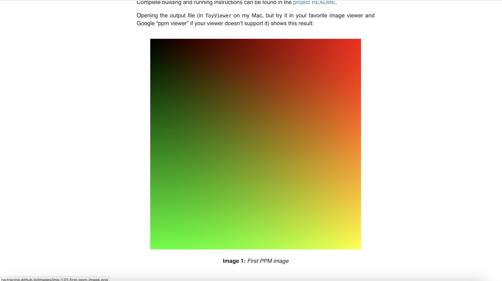

Hour 1

Date: 09/07/2025 (mm/dd/yyyy)

Time range: 11:15 AM - 12:15 PM

Description: I began by trying to create a simple base set-up for the program with input-handling and clean VGA output (in a simple game loop). To do this, I began by trying to make a simple output screen of a single monochrome color (there are only four possible colors). However, this took me a while as I was first leanring and understanding how the VGA output was actually being displayed. However, once I had done this, I was confronted by an issue where the game loop wasn't able to set the RGB output to a wire value. After a while going through the example projects, tutorial and online forums, I realized that the blank project actually had RGB set to being a wire by default instead of a reg (which is how it was set up in the Flappy Bird demo). Once I fixed this, I was able to duspklay a solid block of color to the VGA output and change it by changing the value of 'val'. I then attempted to make this value increment when the 'up' button on the gamepad was pressed. This should have been simple but for some reason led to random bars appearing when the button was pressed and no change when released. I eventually solved this by realizing that I would need to add a counter variable to only update the 'val' value once per click. The resultant code has been committed to the Github repository and a screenshot can be found below.

Hour 2-3

Date: 09/07/2025 (mm/dd/yyyy)

Time range: 7:00 PM - 9:00 PM

Description: I began this coding session by first determining which corner the VGA pixel system is indexed from. This was because I had doubts about whether or not it followed the typical game development style with a top-left origin or followed a mathematical cartesian plane with a bottom-left origin (or something else entirely). To do this, I made tests which would only illuminate pixels in the corner of the origin which led me to find out that the origin follows game development and is located in the top-left corner. Once I had this determined, I could begin by making the first file output gradient test demo from the [Ray Tracing in One Weekend](https://raytracing.github.io/books/RayTracingInOneWeekend.html) tutorial. While the FPGA version is nowhere near as nice or as smooth as the software demo from the tutorial, it worked as a simple proof of concept for computed display output before diving into the mathematical complexities of true path tracing. The majority of the differences between mine and the tutorial is due to the fact that this VGA output uses 2-bit color instead of 8-bit color and the fact that I designed this to work on purely integers without divison rather than floating-point with divison. Both images can be seen below.

After this, I spent time learning how a virtual camera actually worked in a ray tracer from the same tutorial and what vector conversions would be necessary to convert image data from virtual to real pixels. I then used this to hand-calculate the necessary constant vectors for ray tracing and their necessary bit allocations, whether or not to make them signed/unsigned and how to modify them to work purely on integers without division or floating-point values. My next steps at the beginning of my next session would be to clean up my existing code and comment everything for clarity as the complexity of the path tracer will skyrocket from here.