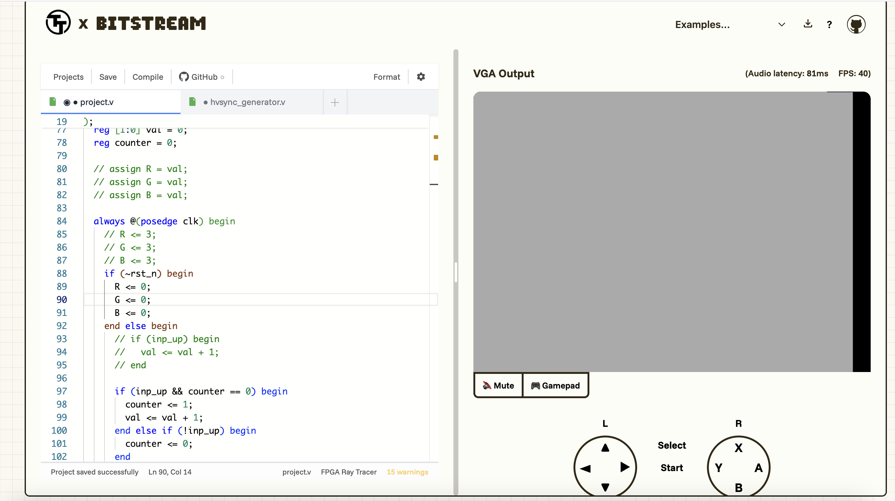

Hour 1

Date: 09/07/2025 (mm/dd/yyyy)

Time range: 11:15 AM - 12:15 PM

Description: I began by trying to create a simple base set-up for the program with input-handling and clean VGA output (in a simple game loop). To do this, I began by trying to make a simple output screen of a single monochrome color (there are only four possible colors). However, this took me a while as I was first leanring and understanding how the VGA output was actually being displayed. However, once I had done this, I was confronted by an issue where the game loop wasn't able to set the RGB output to a wire value. After a while going through the example projects, tutorial and online forums, I realized that the blank project actually had RGB set to being a wire by default instead of a reg (which is how it was set up in the Flappy Bird demo). Once I fixed this, I was able to duspklay a solid block of color to the VGA output and change it by changing the value of 'val'. I then attempted to make this value increment when the 'up' button on the gamepad was pressed. This should have been simple but for some reason led to random bars appearing when the button was pressed and no change when released. I eventually solved this by realizing that I would need to add a counter variable to only update the 'val' value once per click. The resultant code has been committed to the Github repository and a screenshot can be found below.

